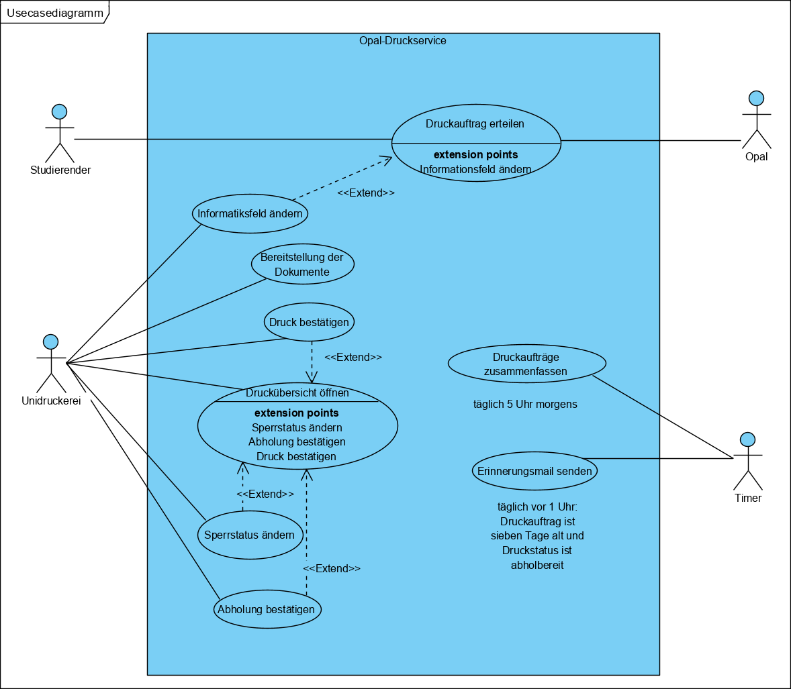

= Use-Case Model: Opal-Druckservice
Kai Löning s77721@htw-dresden.de; Tom Jandke s77831@htw-dresden.de
:toc: 
:toc-title: Inhaltsverzeichnis
:sectnums:

[%header]
== Identifizierte Use Cases
=== für Akteur Studierende
* UC1: Druckauftrag erteilen
* UC2: Druckübersicht öffnen
* UC3: Bereitstellung der Dokumente

=== für Akteur Timer
* UC4: Druckaufträge zusammenfassen
* UC5: Erinnerungsmail senden

=== für Akteur Unidruckerei
* UC6: Druck bestätigen
* UC7: Abholung bestätigen
* UC8: Informationsfeld ändern
* UC9: Sperrstatus ändern

=== für Akteur Opal
* UC1: Druckauftrag erteilen (Anmerkung: Opal agiert als externes System und leitet beim Erstellen des Druckauftrags Daten an das System zur Druckverarbeitung weiter)

== Use Case Diagramm

== Priorisierung der Use Cases

|===
|Use Case ID|	Use Case Name	| Priorität (1-5)

|UC1|   Druckauftrag erteilen	| 5
|UC2|	Druckübersicht öffnen	| 4
|UC3|	Bereitstellung der Dokumente	| 5
|UC4|	Druckaufträge zusammenfassen	| 5
|UC5|	Erinnerungsmail senden	| 2
|UC6|	Druck bestätigen	| 3
|UC7|	Abholung bestätigen	| 3
|UC8|	Informationsfeld ändern	| 3
|UC9|	Sperrstatus ändern	| 2

|===

== Ausgearbeitete Use Cases

include::Usecases/1_usecase_Druckauftrag_erteilen.adoc[leveloffset=+1]

include::Usecases/2_usecase_Druckuebersicht_oeffnen.adoc[leveloffset=+1]

include::Usecases/3_usecase_Bereitstellung_der_Dokumente.adoc[leveloffset=+1]

include::Usecases/4_usecase_Druckauftraege_zusammenfassen.adoc[leveloffset=+1]

include::Usecases/5_usecase_Erinnerungsmail_senden.adoc[leveloffset=+1]

include::Usecases/6_usecase_Druck_bestaetigen.adoc[leveloffset=+1]

include::Usecases/7_usecase_Abholung_bestaetigen.adoc[leveloffset=+1]

include::Usecases/8_usecase_Informationsfeld_aendern.adoc[leveloffset=+1]

include::Usecases/9_usecase_Sperrstatus_aendern.adoc[leveloffset=+1]

