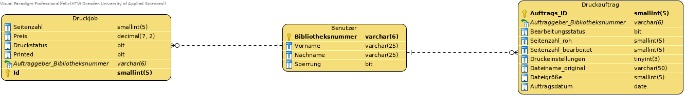
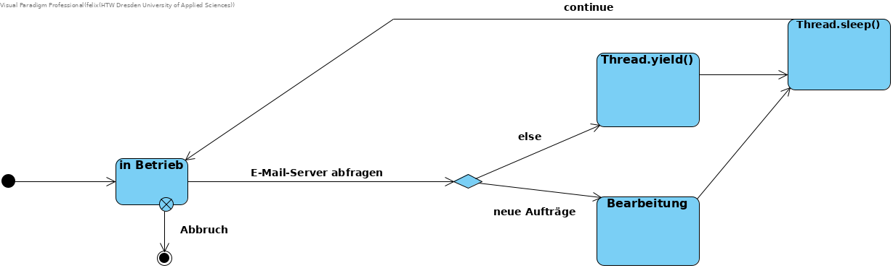
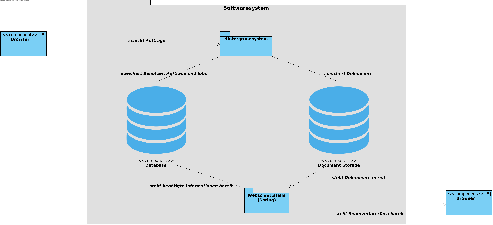
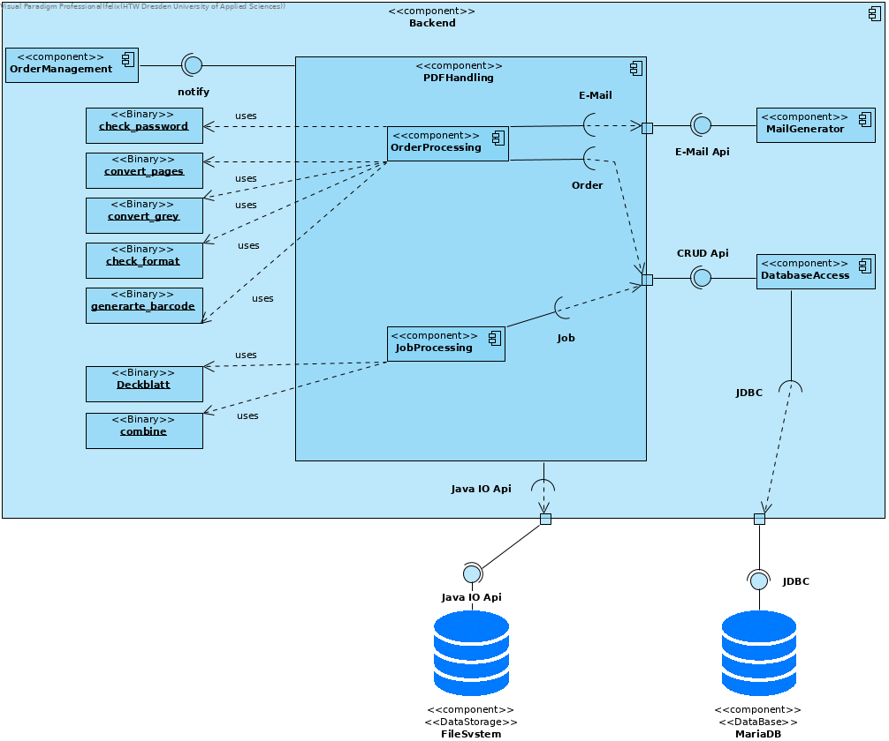
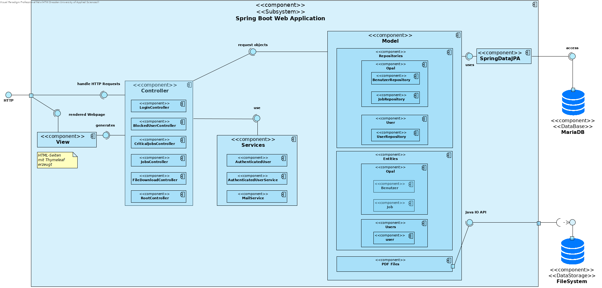
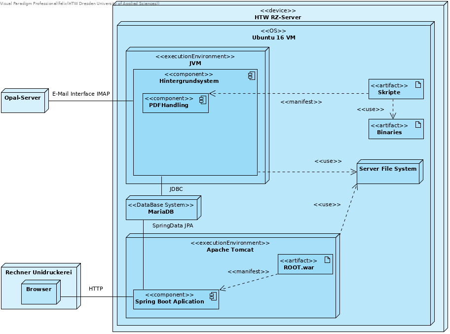
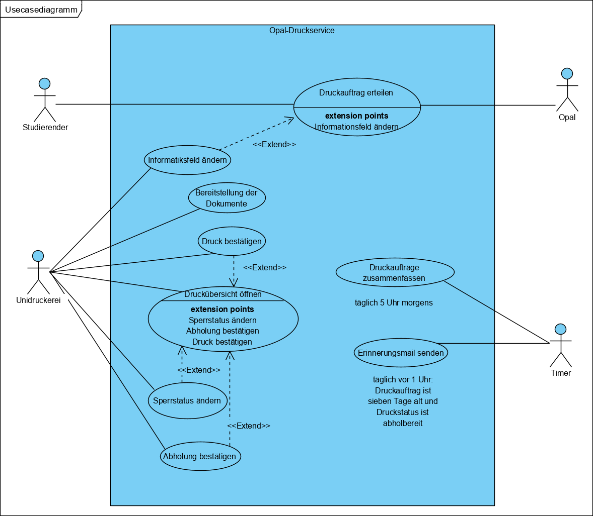

= Architecture Notebook Opal Druckauftrag
Felix Müller <felix.mueller@htw-dresden.de>
0.3, 06.04.2020
:toc: 
:toc-title: Inhaltsverzeichnis
:sectnums:
// Platzhalter für weitere Dokumenten-Attribute

== Zweck
Dieses Dokument beschreibt wesentliche Elemente der Architektur zur Realisierung eines in der link:https://github.com/FrancescoRy/Opal_Druckservice/blob/master/Docs/Anforderungsspezifikation/vision.adoc[_Vision_] beschriebenen Druckservice für Studenten.
Dabei werden die Philosophie, Entscheidungen, Nebenbedingungen, Begründungen, wesentliche Elemente und andere übergreifende Aspekte des Systems, die Einfluss auf Entwurf und Implementierung haben, beschrieben. Dieses Dokument fasst die Architekturentscheidungen zusammen, stellt Begründungen für diese Entscheidungen dar und dokumentiert Alternativen.
Durch Muster und Entwürfe wird die zu erstrebende Systemorganisation, notwendige Abstraktionen und eine Modularisierung des Problems dargestellt, um das Design, die Entwicklung und Wartung des Systems zu ermöglichen. Außerdem beschreibt dieses Dokument wesentliche Kommunikationsschnittstellen der Systemkomponenten.

//Hinweise: Bearbeiten Sie immer die Abschnitte 2-6 dieser Vorlage. Nachfolgende Abschnitte sind empfohlen, aber optional und sollten je nach Umfang der künftigen Wartungsarbeiten, Fähigkeiten des Entwicklungsteams und Bedeutung anderer architektureller Belange. 

//Anmerkung: Die Architektur legt wesentliche EINSCHRÄNKUNGEN für den Systementwurf fest und ist ein Schlüssel für die Erfüllung nicht-funktionaler Eigenschaften!

== Architekturziele und Philosophie
//Hinweise: Beschreiben Sie die Philosophie der Architektur, d.h. den zentralen Ansatz für ihre Architektur. Identifizieren Sie alle Aspekte, die die Philosophie beeinflussen, z.B. komplexe Auslieferung Aspekte, Anpassung von Altsystemen oder besondere Geschwindigkeitsanforderungen. Muss es besonders robust sein, um eine langfristige Wartung und Pflege zu ermöglichen?

Der Architekturentwurf sieht eine Webanwendung zur Darstellung der Aufträge für die Mitarbeiter der UNIDruckerei und ein Hintergrundsystem, bestehend aus einer relationalen Datenbank zur Verwaltung der Benutzer und Aufträge, einem Programm zur Steuerung des Arbeitsablaufs und ausführbaren Dateien zur Implementierung der Geschäftslogik (PDF) vor. In jedem Schritt der Datenverarbeitung muss die Integrität und Korrektheit der Daten gewährleistet sein.

Das Ziel des Architekturentwurfs ist es

. die Entwicklung einer möglichst schlanken und ressourcenschonenden Webanwendung zu ermöglichen.
.. ausreichende Geschwindigkeit bei Navigation und Datentransfer
.. gute Bedienbarkeit
. die Entwicklung eines Hintergrundsystem, das die Hauptlast der Problemlösung trägt, zu ermöglichen.
. Weiterhin soll der Datentransfer zwischen dem Opal-Server und dem link:https://github.com/FrancescoRy/Opal_Druckservice/blob/master/Docs/Anforderungsspezifikation/vision.adoc[_Softwaresystem_] durch Nutzung einer effizienteren Kommunikationsschnittstelle optimiert werden.

=== allgemeine Anforderungen

Sowohl die link:https://github.com/FrancescoRy/Opal_Druckservice/blob/master/Docs/Anforderungsspezifikation/glossary.adoc[_Webanwendung_], als auch das Hintergrundsystem sollen im Entwurf gut modularisiert und klar strukturiert sein, um Entwicklung und Wartung zu ermöglichen.

//Formulieren Sie eine Reihe von Zielen, die die Architektur in ihrer Struktur und ihrem Verhalten erfüllen muss. Identifizieren Sie kritische Fragen, die von der Architektur adressiert werden müssen, z.B. besondere Hardware-Abhängigkeiten, die vom Rest des Systems isoliert werden sollten oder Sicherstellung der Funktionsfähigkeit unter besonderen Bedingungen (z.B. Offline-Nutzung).

== Annahmen und Abhängigkeiten
//[List the assumptions and dependencies that drive architectural decisions. This could include sensitive or critical areas, dependencies on legacy interfaces, the skill and experience of the team, the availability of important resources, and so forth]

. Wir bekommen durch das Rechenzentrum der HTW einen Server mit ausreichenden Ressourcen zur Verfügung gestellt.
. Wir können auf dem Server alle benötigten Frameworks, Programmiersprache und Datenbankmodelle verwenden.
. Eine Minimierung der Anzahl unterschiedlicher Technologien, Programmiersprachen und Frameworks ist wünschenswert.
. Verwendete Frameworks und Programmierbibliotheken funktionieren im Sinne unseres Entwurfs und bleiben in Zukunft einsetzbar und kompatibel.

== Architektur-relevante Anforderungen
//Fügen Sie eine Referenz / Link zu den Anforderungen ein, die implementiert werden müssen, um die Architektur zu erzeugen.

|===
|Anforderung |Systemkomponente |Architekturmechanismen

|link:https://github.com/FrancescoRy/Opal_Druckservice/blob/master/Docs/Anforderungsspezifikation/Usecases/1_usecase_Druckauftrag_erteilen.adoc[_Druckauftrag erteilen_]
|Opal-Server, Hintergrundsystem
|<<E-Mail-Kommunikation>>, <<Datenpersistenz>>

|link:https://github.com/FrancescoRy/Opal_Druckservice/blob/master/Docs/Anforderungsspezifikation/Usecases/4_usecase_Druckauftraege_zusammenfassen.adoc[_Druckaufträge zusammenfassen und formatieren_]
|Hintergrundsystem
|<<Datenpersistenz>>, <<E-Mail-Kommunikation>>, <<PDF-Logik>>

|link:https://github.com/FrancescoRy/Opal_Druckservice/blob/master/Docs/Anforderungsspezifikation/Usecases/5_usecase_Erinnerungsmail_senden.adoc[_Erinnerungsmail versenden_]
|Hintergrundsystem
|<<Datenpersistenz>>, <<E-Mail-Kommunikation>>

|link:https://github.com/FrancescoRy/Opal_Druckservice/blob/master/Docs/Anforderungsspezifikation/Usecases/6_usecase_Druck_bestaetigen.adoc[_Druck bestätigen_], link:https://github.com/FrancescoRy/Opal_Druckservice/blob/master/Docs/Anforderungsspezifikation/Usecases/7_usecase_Abholung_bestaetigen.adoc[_Abholung bestätigen_], link:https://github.com/FrancescoRy/Opal_Druckservice/blob/master/Docs/Anforderungsspezifikation/Usecases/9_usecase_Sperrstatus_aendern.adoc[_Sperrvermerk ändern_]
|Webanwendung, Hintergrundsystem
|<<Datenpersistenz>>, <<Webschnittstelle>>

|NFAU-2, NFAF-2
|Hintergrundsystem, Webanwendung
|<<Webschnittstelle>>, <<Datenpersistenz>>

|NRAR-1
|Hintergrundsystem
|<<E-Mail-Kommunikation>>

|NRAR-2, NRAP-1
|Hintergrundsystem
|<<PDF-Logik>>

|NRAR-3
|Hintergrundsystem, Webanwendung
|<<PDF-Logik>>, <<Webschnittstelle>>

|NFAF-1
|Hintergrundsystem
|<<Prozesssteuerung>>
|===

== Entscheidungen, Nebenbedingungen und Begründungen 
//[List the decisions that have been made regarding architectural approaches and the constraints being placed on the way that the developers build the system. These will serve as guidelines for defining architecturally significant parts of the system. Justify each decision or constraint so that developers understand the importance of building the system according to the context created by those decisions and constraints. This may include a list of DOs and DON’Ts to guide the developers in building the system.] 

. Zur Implementierung der Hintergund-Anwendung wird Java verwendet.
. Der Quellcode in Java soll durch die Benutzung von Javadoc kommentiert werden, um automatisch Dokumentationsdateien erstellen zu können.
. Verwendete Bibliotheken, Frameworks u.ä. sollten Open Source bzw. Freeware sein,da die Umsetzung des Systems im universitären Bereich erfolgt, der Druckservice relativ hohe bisherige Gesamtkosten verursacht hat und perspektivisch die Preise für Jahreslizenzen steigen.
. Zur Verwaltung der Druckaufträge, Druckjobs und Benutzer soll eine Datenbank verwendet werden. Es wird MariaDB verwendet, da die Technologie unter der GNU-Lizenz steht, mit JPA/JDBS eine Anbindung an Java-Programme möglich ist und auch Kompatibilität zu gängigen Web-Frameworks besteht.
. Um Kommunikation zwischen einzelnen Modulen zu ermöglichen, werden bei der Implementierung der Hintergrundanwendung definierte Schnittstellen für Daten und Befehle verwendet.
. Die einzelnen Komponenten sollen lose verbunden sein.
. Information Hiding soll durch Sichtbarkeitsattribute und die Verwendung einer Datenbank gewährleistet werden.

== Architekturmechanismen
https://www2.htw-dresden.de/~anke/openup/core.tech.common.extend_supp/guidances/concepts/arch_mechanism_2932DFB6.html[Doku "Concept: Architectural Mechanism"]
//[List the architectural mechanisms and describe the current state of each one. Initially, each mechanism may be only name and a brief description. They will evolve until the mechanism is a collaboration or pattern that can be directly applied to some aspect of the design.]
//Beispiele: relationales DBMS, Messaging-Dienste, Transaktionsserver, Webserver, Publish-Subscribe Mechanismus
//Beschreiben Sie den Zweck, Eigenschaften und Funktion der Architekturmechanismen.

=== Datenpersistenz

==== Datenspeicherung Dokumente aus Druckaufträgen (Hintergrundsystem)
*  Zweck: Bereitstellen der link:https://github.com/FrancescoRy/Opal_Druckservice/blob/master/Docs/Anforderungsspezifikation/glossary.adoc[_Dokumente_] aus den Druckaufträgen im link:https://github.com/FrancescoRy/Opal_Druckservice/blob/master/Docs/Anforderungsspezifikation/glossary.adoc[_PDF_]-Format mindestens bis diese umgewandelt und zu Druckjobs zusammengefasst sind. 
*  Größe einer Datei: maximal 20 MB, nach der Umwandlung durch Graustufen und link:https://github.com/FrancescoRy/Opal_Druckservice/blob/master/Docs/Anforderungsspezifikation/glossary.adoc[_Blattseiten_] eher weniger
* Anzahl Dateien:
. maximal 5000 (Anzahl Studenten der HTW) * mittlere Anzahl Aufträge pro link:https://github.com/FrancescoRy/Opal_Druckservice/blob/master/Docs/Anforderungsspezifikation/glossary.adoc[_Benutzer_] pro Tag
* Speicherzeit: typischerweise maximal 24 h
* Identifizierung: eindeutige laufende Nummer als Dateiname (Id aus der Datenbank)
* Sicherheit: 
. Daten müssen Crash des link:https://github.com/FrancescoRy/Opal_Druckservice/blob/master/Docs/Anforderungsspezifikation/glossary.adoc[_Softwaresystems_] oder Servers überstehen
* Realisierung: Speicherung in einem Verzeichnis auf der VM

==== Datenspeicherung Dokumente der Druckjobs (Hintergrundsystem)
*  Zweck: Bereitstellen der druckbaren und umgewandelten link:https://github.com/FrancescoRy/Opal_Druckservice/blob/master/Docs/Anforderungsspezifikation/glossary.adoc[_Dokumente_] im link:link:https://github.com/FrancescoRy/Opal_Druckservice/blob/master/Docs/Anforderungsspezifikation/glossary.adoc[_PDF_]-Format mit Hilfe der Webanwendung, bis diese von der UNIDruckerei als gedruckt gekennzeichnet werden.
*  Größe einer Datei:
. maximal 20 MB * mittlere Anzahl Aufträge pro link:https://github.com/FrancescoRy/Opal_Druckservice/blob/master/Docs/Anforderungsspezifikation/glossary.adoc[_Benutzer_] pro Tag
* Anzahl Dateien:
. maximal 5000 (Anzahl Studenten der HTW)
* Speicherzeit: typischerweise maximal 24 h
* Identifizierung: eindeutige laufende Nummer als Dateiname (Id aus der Datenbank)
* Sicherheit: 
. Daten müssen Crash des link:https://github.com/FrancescoRy/Opal_Druckservice/blob/master/Docs/Anforderungsspezifikation/glossary.adoc[_Softwaresystems_] oder Servers überstehen
* Realisierung: Speicherung in einem Verzeichnis auf dem Server

''' 
==== Datenbank

(genaue Datentypen der DB-Beschreibung im Hauptordner entnehmen)
Die Speicherung der Benutzerinformationen, Druckaufträge und Druckjobs soll durch eine relationalen Datenbank geleistet werden. Die Datenbank wird an das Hintergrundsystem durch JDBC angebunden, das ermöglicht bei Bedarf Loging. Anbindung der <<Webschnittstelle>>.

==== Datenspeicherung Benutzerinformationen (Hintergrundsystem)
* Zweck: Verfügbarkeit 
. des link:https://github.com/FrancescoRy/Opal_Druckservice/blob/master/Docs/Anforderungsspezifikation/glossary.adoc[_Sperrvermerks_] zur Überprüfung aus Sperrung
. der E-Mail-Adresse zur Adressierung von E-Mails zum Druckstatus
. weiterer Informationen wie Aufträge oder Seitenzahl pro Semester für Statistiken
. des zu begleichenden Betrags
* Anzahl Datensätze: potenziell circa 5000 (Anzahl Studenten der HTW), 2019 laut Statistik 3889 verschiedene Benutzer
* Sicherheit: 
. datenschutzgerecht
. Daten sollten Crash des link:https://github.com/FrancescoRy/Opal_Druckservice/blob/master/Docs/Anforderungsspezifikation/glossary.adoc[_Softwaresystems_] oder Servers überstehen
* Realisierung: Tabelle einer relationalen Datenbank (MariaDB)

==== Datenspeicherung  Metainformationen Druckaufträge

* Zweck: Verfügbarkeit
. des Druckstatus, um zu identifizieren, ob der Auftrag noch zusammengefasst werden muss
. Seitenzahl zur Preisberechnung (die Seitenzahl muss nach dem Umwandeln in eine beliebige Anzahl Blattseiten neu bestimmt und gespeichert werden)
. Name der Datei zur Identifikation im Verzeichnis
* Anzahl Datensätze: 
. Mittelwert laut Statistik ~ 85
. Spitzenwert laut Statistik ~ 400
* Sicherheit: 
. datenschutzgerecht
. Daten sollten Crash des link:https://github.com/FrancescoRy/Opal_Druckservice/blob/master/Docs/Anforderungsspezifikation/glossary.adoc[_Softwaresystems_] oder Servers überstehen
* Realisierung: Tabelle einer relationalen Datenbank (MariaDB)

==== Datenspeicherung Metainformationen Druckjobs
* Zweck: Verfügbarkeit
. des Druckstatus zur Aktualisierung bei Druck bzw. Abholung durch Auftraggeber
. des Druckstatus, um (zu lange) nicht abgeholte Dokumente zu identifizieren
. der Seitenzahl, um die Preisberechnung zu ermöglichen
* Anzahl Datensätze: 
. der Mittelwert ist laut Statistik kleiner als ~ 85
* Sicherheit: 
. datenschutzgerecht
. Daten sollten Crash des link:/Docs/glossary.adoclink:https://github.com/FrancescoRy/Opal_Druckservice/blob/master/Docs/Anforderungsspezifikation/glossary.adoc[_Softwaresystems_] oder Servers überstehen
* Realisierung: Tabelle einer relationalen Datenbank (MariaDB)

=== Webschnittstelle

Zur Realisierung der Webanwendung verwenden wir einen Apache Tomcat Webserver (link:https://tomcat.apache.org/[Apache Tomcat]) und das Spring Boot Framework (link:https://spring.io/projects/spring-boot#overview[Spring Boot]). Diese Technologie ermöglichen uns ein User-Interface zu entwerfen und eine performante Möglichkeit das Datenbanksystem anzubinden.

==== Datenanbindung

Als Connector zwischen dem Hintergrundsystem und der Datenbank verwenden wir JDBC.
Die Verwendung von Triggern für die Datenbank ist noch zu diskutieren.

==== Grafische Oberfläche

Die grafische Oberfläche der Webanwendung sollte den nicht funktionalen Anforderung (link:https://github.com/FrancescoRy/Opal_Druckservice/blob/master/Docs/Anforderungsspezifikation/systemwide_reqs.adoc[_siehe_]) entsprechen. Zur Umsetzung dieser Anforderungen wird HTML, CSS, JavaScript und Bootstrap verwendet.

==== Authentifizierung, Login und Sessions

Durch die Implementierung einer Webanwendung  ist es nötig, dass sich Benutzer der Webanwendung authentifizieren. Es ist eine Authentifizierung mit einem Passwort vorgesehen.

* Realisierung: Spring Security

==== Download

Da HTTP ein zustandsloses Protokoll ist wird ein 3-Wege-Handshake verwendet bevor Daten verändert werden:

* Download anfragen
* Serverantwort
* Bestätigung des erfolgreichen Downloads

=== E-Mail-Kommunikation
* Umfang: wenige KB
* Latenz: einige Minuten (5 bis 10 Minuten)
* Realisierung: JavaMail (mit Erweiterung für Microsoft Exchange) aus der JavaEE

==== Abholung neuer Druckaufträge
* Herunterladen der E-Mails und entsprechenden Anhänge vom E-Mail-Server
* Parsen der Druckeinstellung und Benutzerinformationen

==== Hintergrundsystem
* Eingangsbestätigung
* Sperrung
* Fehler bei Bearbeitung
* Erinnerung zur Abholung

==== Webanwendung
* Nutzer wird gesperrt

=== PDF-Logik
* Zweck: Umwandlung von farbigen _Dokumenten_ in Graustufen, Umsetzen der link:https://github.com/FrancescoRy/Opal_Druckservice/blob/master/Docs/Anforderungsspezifikation/glossary.adoc[_Druckeinstellungen_] und (wenn realisierbar) Druckbarkeit prüfen
* Größe einer Datei: initial maximal  20 MB
* Anzahl Dateien: potenziell 5000 (Anzahl Studenten der HTW) * mittlere Anzahl Aufträge pro link:https://github.com/FrancescoRy/Opal_Druckservice/blob/master/Docs/Anforderungsspezifikation/glossary.adoc[_Benutzer_] pro Tag
* Realisierung:  Zeitlich gesteuertes Starten von Prozessen, die Bash-Skripte zur Bearbeitung der Dokumente ausführen.

=== Prozesssteuerung

==== Starten der täglich auszuführenden Programme
* Realisierung: Java Timer

==== Zyklisches Abholen neuer Aufträge vom E-Mailserver
* Zweck: Verringerung der CPU-Auslastung, Vermeidung von Bussy-Waiting
* Realisierung: sleep
* sleep versetzt den Prozess in den Wartezustand und yield gibt einen erhaltenen CPU-Slot zurück an das Betriebsystem 
* die Benutzung von yield ist ggf. nicht notwendig

== Wesentliche Abstraktionen

Container-Diagramm:

* Pfeile stellen Interaktionen der zwischen Komponenten dar
* Kästen stellen Komponenten dar
* Tonnen stellen Datenpersistenz dar

grober Workflow vom Eingang eines Druckauftrags bis zur Erstellung eines Druckjobs

. Abfrage des E-Mail-Postfachs auf neue Aufträge
. Datenbankanfrage auf Sperrung des Benutzers
. Eintrag des Druckauftrags in Datenbanktabelle für Druckaufträge
. Umsetzen der Druckeinstellungen und Umwandlung in Graustufen
. Zusammenfassen aller Druckaufträge eines Benutzers zu einem Druckjob (5:OO Uhr)
. Eintragen aller Druckjobs in Datenbanktabelle für Druckjobs und löschen aller zusammengefasster Druckaufträge aus der Datenbanktabelle für Druckaufträge

//[List and briefly describe the key abstractions of the system. This should be a relatively short list of the critical concepts that define the system. The key abstractions will usually translate to the initial analysis classes and important patterns.]

== Schichten oder Architektur-Framework

=== Hintergrundsystem

Das Hintergrundsystem wird in drei wesentliche Komponenten strukturiert:

* OrderManagement:  dient der Abholung neuer Aufträge (<<E-Mail-Kommunikation>>)
* Logik-Schicht: implementiert die Geschäftslogik zur Umwandlung der Dokumente und zum Versenden von E-Mails
* Daten-Schicht: dient dem persistenten abspeichern von Dokumenten, Benutzerinformationen, Druckaufträgen- und jobs (<<Datenpersistenz>>)

==== Zuständigkeiten der Komponenten
* OrderManagement: holt Aufträge ab 
* PDF-Handling: steuert die Abarbeitung der Bash-Skripte, behandelt Fehler, speichert um gewandelte Dokumente ab und aktualisiert DB-Einträge

. Preprocessing: Graustufen und Blattseiten
. Processing: Aufträge zu Druckjob zusammenfassen und Deckblatt erstellen

* DataAccessManagement: zuständig für alle DB-Anfragen, kapselt DB-Zugriff, stellt CRUD API bereit
* MailGenerator: Generieren und Versenden von E-Mails (<<E-Mail-Kommunikation>>)

=== Web-Anwendung

* MVC

//[Describe the architectural pattern that you will use or how the architecture will be consistent and uniform. This could be a simple reference to an existing or well-known architectural pattern, such as the Layer framework, a reference to a high-level model of the framework, or a description of how the major system components should be put together.]

== Architektursichten (Views)
//[Describe the architectural views that you will use to describe the software architecture. This illustrates the different perspectives that you will make available to review and to document architectural decisions.]

=== Logische Sicht
Beschreibung von Schnittstellen und Paketstrukturen

//Beschreibt die Struktur und das Verhalten Systemteilen, die hohen Einfluss auf die Architektur haben. Dies kann die Paketstruktur, kritische Schnittstellen, wichtige Klassen und Subsysteme sowie die Beziehungen zwischen diesen Elementen enthalten. Zudem sollten die physische und logische Sicht persistenter Daten beschrieben werden, wenn es diesen Aspekt im System gibt. Dies ist ein hier dokumentierter Teilaspekt des Entwurfs.
==== Schnittstelle zwischen Opal-Server und Hintergrundsystem
* Dokument zu Druckauftrag: Anhang der E-Mail
* Druckeinstellungen: im E-Mail-Body (XML Format)
* Benutzerinformationen: im E-Mail-Body (XML Format)
* diese Schnittstelle soll perspektivisch durch eine REST-API des Opal-Servers und eine entsprechende Komponente im Hintergrundsystem abgelöst werden.

|===
2+| Datendarstellung

.3+| Benutzerinformationen

| **Bibliotheksnummer**
| Name
| Vorname

.3+| Auftragsinformationen
| **Dateiname** (Id aus Datenbank)
| Druckeinstellungen
| Preis
|===

==== Schnittstelle zwischen Hintergrundsystem und Webanwendung
* PDF-Dokumente und Datenbank (siehe <<Datenpersistenz>>)

==== Schnittstelle zwischen Webanwendung und UNIDruckerei
* HMTL, (CSS und JavaScript)
* PDF und Zip

=== Physische Sicht (Betriebssicht)
//Beschreibt die physischen Knoten (Rechner) des Systems, der Prozesse, Threads und Komponenten, die in diesen Knoten ausgeführt werden. Diese Sicht wird nicht benötigt, wenn das System in einem einzelnen Prozess oder Thread ausgeführt wird.

=== Use cases
//Eine Liste oder ein Diagramm der Use Cases, die architektur-relevante Anforderungen enthalten.

